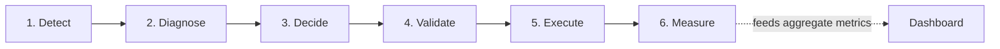
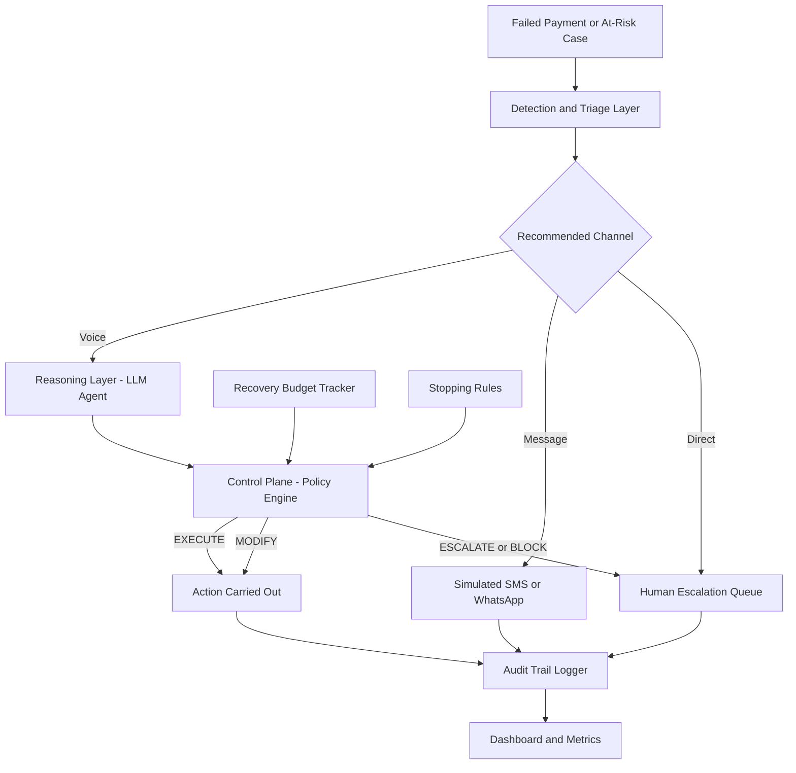
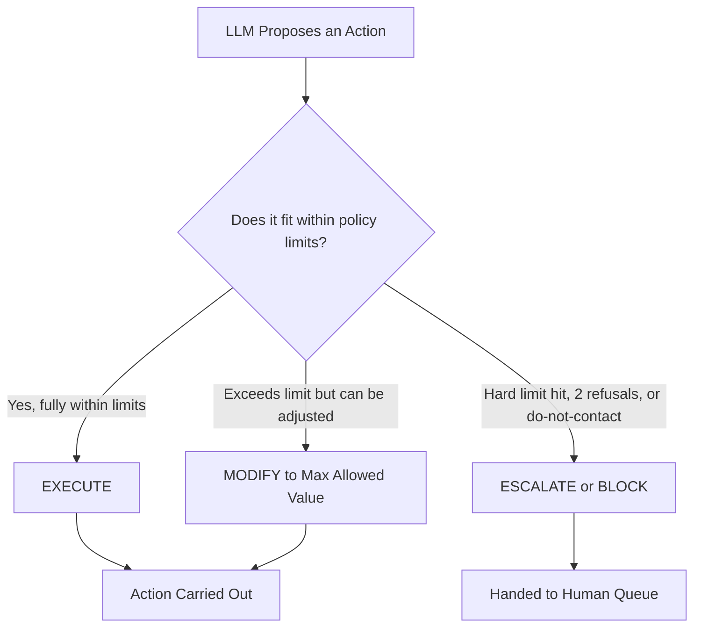

# AI Revenue Recovery Agent with Deterministic Control Plane
## Full Project Specification — Razorpay AI Buildathon 2026, Track 03 (AI Revenue Recovery)

---

## Table of Contents

1. Project Summary
2. Problem Statement & Motivation
3. Why This Approach (Differentiation Strategy)
4. Track Alignment
5. Core Product Loop
6. System Architecture & Components
7. Decision Framework Detail
8. Technology Stack (Zero Monetary Cost)
9. Data Model Notes
10. Metrics & Evaluation
11. Demo Strategy
12. Ten-Day Solo Build Plan
13. Scope Discipline — What Not to Build
14. Risks & Mitigations
15. Deliverables Checklist

---

## 1. Project Summary

This project is an AI-powered Revenue Recovery Agent for failed payments, built for Razorpay's AI Buildathon 2026. It is not a simple calling bot. It is a complete recovery control loop: detect a payment at risk, diagnose why it failed, decide the right intervention, validate that intervention against merchant-defined policy, execute it, and measure the outcome.

The core innovation is a separation between two systems that must never be merged:

1. A reasoning layer (an LLM) that proposes what action to take for a given failed payment or at-risk customer.
2. A deterministic control plane (plain rule-based logic, not an AI model) that decides whether that proposed action is allowed to actually happen.

The guiding principle for the entire build: the AI decides what it wants to do. The control plane decides what it is allowed to do. This makes the system bounded, auditable, and explainable, which is the explicit bar Razorpay set in the buildathon brief for Track 03 and for financial AI agents generally.

The customer-facing surface is a Hinglish-capable voice agent that calls customers about failed UPI Autopay mandates, overdue EMIs, or failed subscription renewals, and negotiates a resolution (retry, extension, discount, promise-to-pay) within pre-approved bounds. All calls in the final demo are pre-recorded, generated ahead of time using free/open-source text-to-speech, not live telephony.

The entire build must run at zero monetary cost, using free-tier and open-source tools only, as detailed in Section 8.

**At a Glance**

| Aspect | Detail |
|---|---|
| Track | Track 03 — AI Revenue Recovery |
| Core Principle | AI proposes, deterministic control plane decides |
| Customer Surface | Hinglish voice agent (pre-recorded demo calls) |
| Cost | ₹0 — free-tier and open-source tools only |
| Key Differentiator | Real, measurable recovery + visible, working safety control (not just a pitch) |

---

## 2. Problem Statement & Motivation

Failed payments are extremely common in Indian digital payments: UPI Autopay mandates fail due to insufficient balance, bank server timeouts, expired instruments, or customers forgetting about a renewal. EMI and subscription payments fail for similar reasons. Today, recovery of this lost revenue happens in one of two ineffective ways:

- Generic automated nudges (SMS, email) with low conversion, because they are impersonal and easy to ignore.
- Human collections calls, which are effective but expensive, slow to scale, and inconsistent in tone, compliance, and negotiation quality across agents.

There is a real gap between "automated but ignored" and "effective but unscalable." A voice agent that can hold an actual negotiation in the customer's language, understand hesitation or refusal, and act within strict, auditable financial bounds sits directly in that gap.

---

## 3. Why This Approach (Differentiation Strategy)

Most buildathon submissions in this space will likely propose either:
- A generic AI voice/chat bot for payment reminders (too simple, explicitly discouraged by the brief), or
- An abstract "AI agent trust and safety layer" or "agent identity/reputation" platform (a currently trendy idea given the brief's mention of NPCI's UAP, ACP, AP2, and x402 — but abstract control-plane pitches without a live use case are hard to demo convincingly).

This project's differentiation is combining both: a genuinely useful, narrow, demoable product (voice-based revenue recovery) with the safety/control-plane discipline that the trendier submissions will only pitch abstractly. The result is a product where the control plane is not the pitch — it is a visible, working part of a real product, provable with actual recovered rupees, not just a diagram.

| Typical Submission | Weakness | This Project's Approach |
|---|---|---|
| Generic reminder bot | Too simple, no real intelligence, ignored by the brief's bar | Full detect-to-measure loop with real negotiation |
| Abstract agent-safety platform | No live use case, hard to demo, feels theoretical | Control plane embedded in a working product, proven with recorded calls and real ₹ numbers |

Two specific demo moments are designed into this system for maximum impact:
1. A call where the AI proposes an action outside its allowed bounds (for example, a bigger discount than policy allows), and the control plane modifies or blocks it in real time, forcing the agent to offer an approved alternative or escalate to a human.
2. A moment where the recovery campaign's total budget is exhausted, and the system automatically stops offering incentives across all remaining cases, proving the AI cannot silently overspend chasing recoveries.

---

## 4. Track Alignment

This project is submitted under Track 03 — AI Revenue Recovery. The official brief for this track asks for an agent that detects revenue at risk, determines the right intervention, and executes a bounded recovery workflow — explicitly across payment failures, checkout abandonment, and overdue receivables — and lists "Hinglish voice recovery," "mandate retry sequencer," and "promise-to-pay tracker" as example directions. This project directly builds all three of those named example directions into a single coherent product, rather than picking just one.

The brief's stated bar for this track is: do not just identify the problem, show measured money recovered across a batch, with compliant escalation, stopping rules, and an audit trail. Every section of this specification is designed to satisfy that bar with real, non-cherry-picked numbers.

---

## 5. Core Product Loop

The system must implement this exact loop for every case in the dataset:

1. Detect — identify that a payment has failed or revenue is at risk (a failed UPI Autopay mandate, overdue EMI, failed subscription renewal).
2. Diagnose — determine the likely reason for the failure (insufficient balance, expired instrument, bank timeout, customer inaction, prior refusal pattern, etc.) and classify the customer by value tier and risk level.
3. Decide — the triage layer decides the appropriate recovery channel and intervention type based on the diagnosis (see Section 6.1).
4. Validate — before any action is taken with the customer, the AI's proposed action is checked against the control plane's rules, budget, and stopping conditions (see Section 6.3).
5. Execute — the approved (or modified) action is carried out: a voice call is placed (or, in this build, played from a pre-recorded/generated audio asset), a message is logged as sent, or the case is escalated to a human queue.
6. Measure — the outcome of every case is logged and rolled up into aggregate economic metrics (see Section 10).

---

## 6. System Architecture & Components

**Architecture at a Glance**

### 6.1 Revenue-at-Risk Detection & Triage Layer

Before any customer contact happens, every case in the dataset is classified. This is a lightweight rules-plus-LLM classification step, not full autonomy. It should determine:

- Customer value tier (e.g., high, medium, low), derived from transaction amount and/or synthetic customer profile fields.
- Risk level (e.g., first-time failure vs. repeat failure vs. prior explicit refusal).
- Recommended intervention channel: voice call, automated message (SMS/WhatsApp — simulated, not actually integrated, see Section 6.8), automatic silent retry, or direct escalation to a human queue.

This step is what elevates the product from "calls everyone" to "decides who is worth calling and how," which directly satisfies the brief's requirement that the agent "determines the right intervention."

### 6.2 Conversational Reasoning Layer (LLM Agent)

This is the layer that actually holds the negotiation with the customer during a voice case. It should:

- Understand the customer's spoken or typed response (acknowledgment, hesitation, refusal, request for more time, request for a discount).
- Propose a next action in structured form (e.g., "offer 3-day extension," "offer 10% discount if paid today," "log promise-to-pay for [date]," "end call and escalate").
- Never directly execute a financial action itself. It only proposes; the control plane in Section 6.3 approves, modifies, or blocks every single proposal before it becomes real.
- Support a Hinglish conversational style, since this is explicitly what the brief names as an example direction and is the differentiator versus a purely English or purely automated flow.

### 6.3 Control Plane / Policy Engine (Core Differentiator)

This is a separate, deterministic, pure-logic component — not an AI model, and this distinction should be emphasized in the demo and documentation, because determinism is what makes it auditable. Every proposed action from the reasoning layer must pass through it before execution. It returns one of three decision types — see the full table and flow diagram in Section 7.

The specific policy rules the engine must enforce include, at minimum:

- Maximum discount percentage per case.
- Maximum number of contact attempts per case.
- Maximum number of payment retries per case.
- Maximum extension period allowed (e.g., no more than 7 days).
- Mandatory human escalation after two consecutive refusals from the same customer.
- Immediate, permanent stop on all further automated contact if the customer says anything equivalent to "don't call me again" (a hard stop, checked before any other rule, and it must override every other decision).
- A hard rule that the agent must never ask for OTPs, passwords, or other sensitive authentication credentials during a call, under any circumstance.

### 6.4 Recovery Budget System

In addition to per-transaction limits, the merchant (simulated in this build) defines a total financial budget for the entire recovery campaign — for example, ₹50,000 of total discounts and incentives available across the whole batch of cases. Every approved incentive (from an EXECUTE or MODIFY decision) consumes part of this budget in real time. Once the remaining budget falls below a defined threshold, the system automatically stops offering any further incentives for the remaining cases in the batch — it can still attempt recovery through reminders or extensions with no cost, but cannot offer discounts — and this transition should be clearly visible and logged. This proves the agent is bounded not just per-case but at the economic campaign level, and is one of the two key demo moments described in Section 3.

### 6.5 Stopping Rules

All stopping rules must be implemented as explicit, deterministic, auditable logic outside the LLM's control — they must never depend on the LLM "deciding" to stop, because that would make the safety guarantee unenforceable.

| Rule | Limit | Scope |
|---|---|---|
| Max contact attempts | 3 | Per case |
| Max payment retries | 2 | Per case |
| Max extension period | 7 days | Per case |
| Max discount | Merchant-defined % | Per case |
| Human escalation | Triggered after 2 consecutive refusals | Per case |
| Do-not-contact | Immediate, permanent stop | Triggered the moment the customer asks not to be contacted again — overrides all other rules |
| Recovery budget exhaustion | Merchant-defined ₹ cap | Whole campaign/batch |
| Sensitive data request | Never permitted | Applies to every case, always |

### 6.6 Audit Trail / Case Timeline

Every single case must produce a complete, human-readable timeline that includes, in order: the original payment failure event and its details, the customer's profile/context, the AI's diagnosis and triage decision, the full conversation transcript (or simulated message content for non-voice channels), every action the AI proposed, the control plane's decision on each proposal (EXECUTE, MODIFY, or ESCALATE/BLOCK) with the reason, the actual execution result, and the final case outcome. This timeline is a first-class, visible feature of the dashboard, not a hidden log file — it is what lets a judge click into any single case and see exactly why the system did what it did.

### 6.7 Voice Layer

The voice agent is the customer-facing flagship channel and the centerpiece of the demo. Given the zero-cost and solo-builder constraints:

- Do not use paid telephony platforms (e.g., Vapi, Bland) for live calling.
- All demo calls are pre-recorded: generate the conversation audio ahead of time using a free, open-source or browser-based text-to-speech tool (for example, edge-tts, Coqui TTS, or the browser's Web Speech API), rather than relying on live phone infrastructure.
- The conversation content and control-plane decisions for each recorded call must still be generated by the actual reasoning layer and control plane described in Sections 6.2 and 6.3 — the audio generation is only the final step of turning a real, logged conversation into spoken form. This is not scripted theater; it is a real system output rendered as audio.
- At least one recorded call must demonstrate a MODIFY decision, and at least one must demonstrate an ESCALATE/BLOCK decision, so both control-plane behaviors are visibly proven in the demo.

### 6.8 Multi-Channel Routing (Simulated for Non-Voice Channels)

The triage layer (Section 6.1) should genuinely decide, for every case, which channel is appropriate — voice, automated message, silent retry, or human escalation — because this decision-making is itself part of what the brief asks for ("determines the right intervention"). However, to keep scope realistic for a solo ten-day build:

- Only the voice channel is actually built end-to-end with real conversation generation and audio output.
- For cases routed to SMS/WhatsApp/automated message, the system logs the routing decision and generates the message content (using the same reasoning layer, in text form) but does not integrate a real messaging API — the dashboard displays these as "routed to WhatsApp (simulated)" with the generated message shown.
- This preserves the full decision-making logic and demo value of multi-channel triage without requiring three additional live API integrations that would not meaningfully add to the core differentiation.

### 6.9 Dashboard & Metrics

The dashboard is the second major demo asset alongside the voice recordings. It must show, at minimum:

- Aggregate economic metrics for the full batch (see Section 10 for the full list).
- A case list, filterable by outcome, channel, and decision type.
- A clickable per-case audit trail/timeline (Section 6.6).
- A visible representation of the remaining recovery budget and, if applicable, the point in the batch where it was exhausted.
- The headline metric should be framed economically, for example: "₹X revenue at risk → ₹Y net revenue recovered, while preventing Z unsafe autonomous actions" — this is significantly more compelling to judges than a bare accuracy percentage.

Build the dashboard using React with Vite for the frontend, connecting to the FastAPI backend described in Section 8. If time becomes tight, a Streamlit-based dashboard is an acceptable fallback that can be built faster, since judges care primarily about the data and reasoning shown, not the frontend framework.

### 6.10 Data Layer / Synthetic Dataset

Since no real merchant or customer data is available, a synthetic dataset must be generated programmatically. Target 150 to 250 cases — enough for statistically meaningful aggregate metrics without spending excessive build time on data generation. Prioritize diversity of scenarios over sheer volume; the brief explicitly warns that a single cherry-picked result proves nothing.

| Field | Description |
|---|---|
| Case ID | Unique identifier for the case |
| Payment/Mandate Type | UPI Autopay, EMI, or subscription renewal |
| Payment Amount | The at-risk transaction amount |
| Failure Reason | Insufficient balance, expired instrument, bank timeout, customer inaction, etc. |
| Customer Value Tier | High, medium, or low |
| Customer Risk/History Profile | First-time failure, repeat failure, prior explicit refusal, prior promise-to-pay history |
| Ground-Truth Label (if feasible) | An "ideal outcome" or difficulty label, to allow honest accuracy/recall measurement |

---

## 7. Decision Framework Detail (EXECUTE / MODIFY / ESCALATE-BLOCK)

This three-way decision framework, rather than a simple approve/reject binary, is what makes the control plane feel intelligent while remaining fully deterministic underneath.

| Decision | Meaning | Typical Trigger | Worked Example |
|---|---|---|---|
| EXECUTE | Proposed action is fully within policy | Action is at or below every applicable limit | AI proposes an 8% discount; cap is 10% → executed exactly as proposed |
| MODIFY | Action exceeds a limit but can be safely adjusted | Action is above a soft/adjustable limit | AI proposes a ₹2,000 discount; merchant policy caps discounts at ₹1,000 for this tier → control plane approves ₹1,000 instead, conversation continues |
| ESCALATE / BLOCK | Action cannot proceed automatically | A hard limit is hit, the customer has refused twice, or a do-not-contact request was made | Customer has already refused twice → case is routed to a human queue, no further automated offers are made |

Both the MODIFY and ESCALATE/BLOCK branches must be implemented and both must appear in the demo recordings (see Section 6.7 and Section 11).

---

## 8. Technology Stack (Zero Monetary Cost)

Every component of this build must use a free-tier, open-source, or locally-run option.

| Component | Zero-Cost Choice | Why |
|---|---|---|
| LLM / Reasoning | Groq free tier (primary) + Ollama local model, e.g. Llama 3.1 8B (fallback) | Groq is fast with generous free rate limits for quick iteration and demo generation; Ollama has no rate limits at all, so the final full-batch metrics run is guaranteed not to fail mid-run |
| Orchestration | LangGraph | Models the branching control loop (detect → diagnose → decide → validate → execute → measure, with EXECUTE/MODIFY/ESCALATE-BLOCK branches) as an explicit, inspectable state graph rather than a single opaque prompt loop — reinforces the explainability pitch. The control plane must remain a pure deterministic Python node inside the graph; LangGraph only orchestrates *when* it is called, never *what* it decides |
| Structured Output | Pydantic | Validates the LLM's proposed action (type, amount, reasoning) into a clean schema before it reaches the control plane, without the overhead of the full LangChain framework |
| Backend | FastAPI (Python) | Lightweight, fast to build, free |
| Policy Engine / Control Plane | Pure Python | Deterministic rule logic, no external dependencies, inherently free and auditable |
| Database | SQLite (PostgreSQL locally also acceptable) | Zero setup cost, sufficient for demo scale |
| Dashboard | React with Vite (preferred), or Streamlit as a faster fallback | React is already familiar; Streamlit is a time-saver if the schedule tightens |
| Razorpay Integration | Razorpay Test Mode APIs | Official, free, simulates realistic failed-payment states with no live transactions |
| Voice STT/TTS | edge-tts, Coqui TTS, or browser Web Speech API | Free, local or browser-based, no paid telephony needed since all demo calls are pre-recorded |
| Development Tooling | VS Code + GitHub | Standard, free, public repo satisfies submission requirements |
| Hosting | Local demo (primary), optional free tier such as Render/Railway (secondary backup only) | Removes risk of a hosting tier sleeping, cold-starting, or hitting a cap during live judging |

---

## 9. Data Model Notes

In addition to the synthetic case fields listed in Section 6.10, the system must persist, for every case processed through the loop:

| Data Persisted Per Case | Purpose |
|---|---|
| Full sequence of proposed actions from the reasoning layer | Shows what the AI wanted to do at each step |
| Full sequence of control plane decisions (EXECUTE/MODIFY/ESCALATE-BLOCK) with reason and rule triggered | Core of the audit trail; proves every decision is explainable |
| Running recovery budget state at time of each decision | Enables the budget-exhaustion demo moment and dashboard visualization |
| Final case outcome (recovered, partially recovered, escalated, unresolved) | Feeds the aggregate metrics in Section 10 |
| Timestamps for each step | Enables average recovery time calculation |

---

## 10. Metrics & Evaluation

The dashboard and final submission should report, at minimum, the following metrics computed honestly across the full synthetic batch, with no cherry-picking of favorable individual cases.

| Metric | What It Shows |
|---|---|
| Total Revenue at Risk | Sum of all at-risk payment amounts across the batch |
| Gross Revenue Recovered | Total amount successfully recovered, before subtracting incentives |
| Discounts/Incentives Given | Total ₹ spent on discounts and incentives |
| Net Revenue Recovered | Gross Recovered minus Incentives Given |
| Autonomous Recovery Rate | Proportion of recoveries with no human involved |
| Human-Assisted Recovery Rate | Proportion of recoveries that went through escalation |
| Blocked/Modified Action Count | Number of control-plane interventions, with reasons |
| False-Positive Block Cost | Cases where the control plane blocked/modified an action that, in hindsight, was reasonable |
| Escalation Rate | Proportion of total cases escalated to a human |
| Average Recovery Time | Mean time from detection to resolution per case |
| Budget Exhaustion Point | Where in the batch (if at all) the recovery budget ran out, and system behavior afterward |

---

## 11. Demo Strategy

The final submission requires a public repository, a five-minute pitch video, and an explanation of the architecture, per the buildathon's stated submission format.

| Video Segment | Suggested Focus |
|---|---|
| Opening | State the problem in one sentence, show the headline metric: ₹ at risk → ₹ recovered |
| Case Walkthrough | Show one full case timeline end-to-end on the dashboard, including the audit trail |
| MODIFY Moment | Play the recorded call where the AI's proposal is adjusted down by the control plane before reaching the customer |
| Budget Moment | Show the point where the recovery budget is exhausted and incentives automatically stop |
| Closing | Present full batch metrics from Section 10, including an honest false-positive/escalation number — owning the system's limits builds credibility |

---

## 12. Ten-Day Solo Build Plan

Given a solo builder with ten full days available, the recommended sequencing prioritizes the parts that satisfy the track's core rubric before the parts that make the demo memorable, so that even in a worst case (voice or dashboard polish runs short) the submission still clears the bar.

| Day(s) | Focus | Key Deliverable |
|---|---|---|
| 1–2 | Synthetic dataset generator, Razorpay Test Mode wiring, finalize policy rules and budget amount | 150–250 synthetic cases, defined limits |
| 3–4 | Control plane / policy engine build in pure Python, tested against synthetic proposed actions | Working EXECUTE/MODIFY/ESCALATE-BLOCK logic + budget tracker |
| 4–5 | Triage/detection layer | Channel-routing decision logic per case |
| 5–6 | Connect LLM reasoning layer to control plane, text-only first | Full loop working end-to-end on a subset, no voice yet |
| 6–7 | Voice layer: generate TTS audio for curated demo calls | Recorded calls, including one MODIFY and one ESCALATE/BLOCK example |
| 7–8 | Run full batch, compute honest metrics, build dashboard | Real batch metrics, case list, audit trail view, budget visualization |
| 8–9 | Record and edit the pitch video | Finished 5-minute video following Section 11 |
| 9–10 | Architecture doc, README, full end-to-end test, buffer time | Stable local demo, complete public repo documentation |

---

## 13. Scope Discipline — What Not to Build

To protect the solo, ten-day timeline, the following must be explicitly avoided regardless of how tempting they seem mid-build:

- Do not build live telephony or real phone call integration. All demo calls are pre-recorded audio generated from real system output.
- Do not integrate real SMS or WhatsApp APIs. These channels are represented as logged, simulated routing decisions with generated message content only.
- Do not attempt to scale the synthetic dataset beyond roughly 250 cases for its own sake. Diversity of scenario types matters more than raw volume.
- Do not add a fourth or fifth module beyond the core loop (detection, reasoning, control plane, budget, stopping rules, audit trail, voice, dashboard) unless every one of those core pieces is already fully working end-to-end.
- Do not let the LLM reasoning layer perform any action directly. Every single proposed action, without exception, must pass through the control plane first — this rule has no exceptions, including for "obviously safe" actions, because the entire credibility of the submission rests on this boundary being absolute.

---

## 14. Risks & Mitigations

| Risk | Mitigation |
|---|---|
| Free-tier LLM API rate limits fail mid-batch during the final metrics run | Run the full batch against a locally-hosted open-source model via Ollama to remove this dependency entirely |
| Voice/TTS pipeline produces awkward or unnatural Hinglish audio | Generate audio ahead of time, listen to every clip, regenerate any that sound off — possible because calls are pre-recorded, not live |
| Scope creep from the multi-channel and control-plane upgrades adds too much surface area for a solo build | Strictly follow the sequencing in Section 12 and the exclusions in Section 13; core loop must be solid before any polish work begins |
| Free hosting tier fails or behaves unpredictably during live judging | Treat the local demo as primary and any hosted link as a secondary, optional backup only |

---

## 15. Deliverables Checklist

- [ ] A public code repository containing the full working system (backend, control plane, dashboard, dataset generator)
- [ ] A five-minute pitch video following the structure in Section 11
- [ ] A written architecture explanation (can reuse the content of this specification, condensed)
- [ ] The full batch of synthetic case results with honest, unpadded metrics as described in Section 10, viewable in the dashboard
- [ ] A README explaining setup, the zero-cost tech stack choices from Section 8, and how to run the local demo end-to-end
