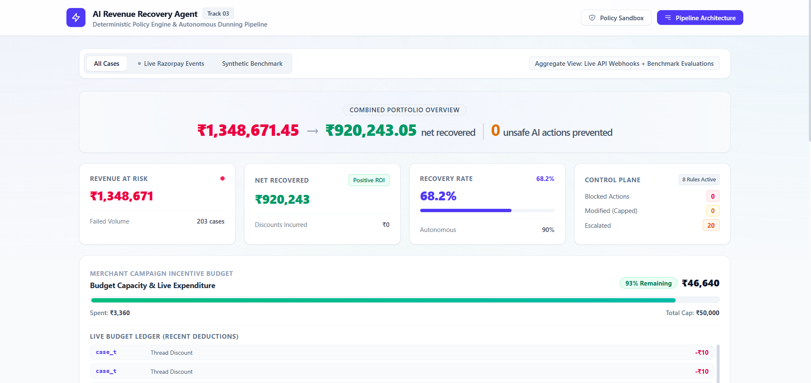
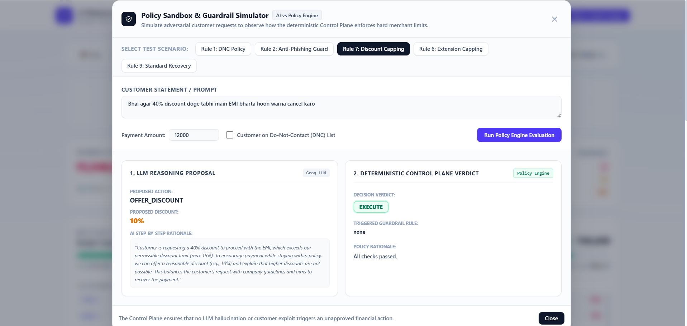
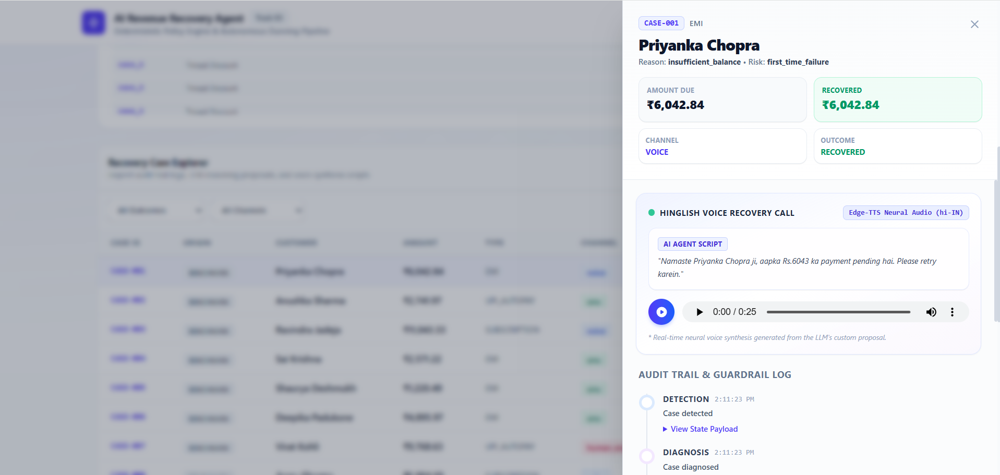
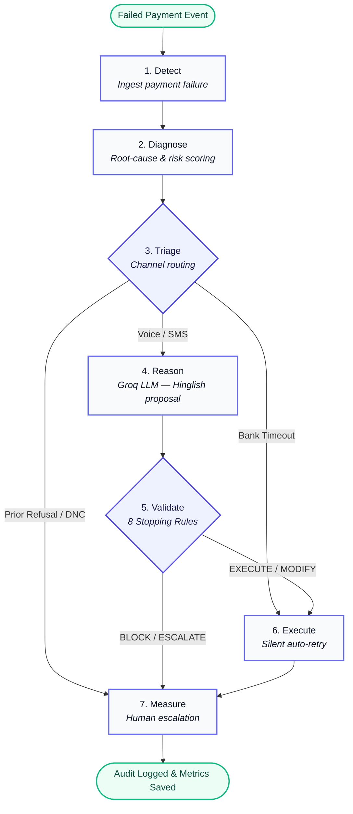

# AI Revenue Recovery Agent

**Razorpay AI Buildathon 2026 — Track 03**

> AI proposes. Control Plane decides. System executes.

An autonomous agent that recovers failed recurring payments (UPI Autopay, EMIs, Subscriptions) using LLM reasoning, real Razorpay APIs, and Hinglish voice calls — while keeping the AI strictly bounded by a deterministic policy engine.

---

## Screenshots

| Dashboard & Metrics | Policy Sandbox | Case Detail & Audit |
|:---:|:---:|:---:|
|  |  |  |

---

## The Problem

Recurring payments in India — UPI Autopay mandates, loan EMIs, SaaS subscriptions — fail at a rate of 12-20%. Most of these are involuntary: insufficient balance, bank timeouts, expired cards. The customer intends to pay, but the payment just fails silently.

Current recovery approaches:
- **Generic emails/SMS** — under 4% conversion. Customers ignore them.
- **Human call centers** — expensive, slow, don't scale for small transactions.
- **Raw AI agents** — dangerous in finance. LLMs hallucinate, offer rogue discounts, ask for OTPs, violate DNC regulations.

This project solves the gap: intelligent, personalized, multilingual recovery that's safe enough to deploy without human supervision.

---

## How It Works

### The Core Idea

Letting an LLM loose on financial decisions is dangerous. So the system separates the "thinking" from the "doing":
1. The **LLM proposes** a recovery strategy (discount, extension, retry, voice call script)
2. A **pure-Python Control Plane** with 8 hard rules validates it
3. Only then does anything actually happen

The AI is creative and conversational. But it can never cross a merchant-defined boundary.

### Pipeline (LangGraph StateGraph)



### Triage Routing

Not every failed payment needs the same treatment:
- **Bank timeout** → Silent auto-retry (no customer contact)
- **High-value EMI** → Personalized Hinglish voice call
- **Low-value UPI** → SMS nudge
- **Customer refused twice** → Skip AI, escalate to human

### The 8 Stopping Rules (Control Plane)

Every LLM proposal must clear these rules in strict waterfall order. They're pure Python — no LLM, no prompt engineering. They cannot be jailbroken.

| Rule | What It Checks | Action |
|---|---|---|
| 1. DNC Check | Customer on Do-Not-Contact list | **BLOCK** — no communication |
| 2. Sensitive Data | AI requesting OTP/CVV/passwords | **BLOCK** — kill the message |
| 3. Contact Limit | Already contacted 3+ times this cycle | **BLOCK** — stop outreach |
| 4. Refusal Threshold | 2 consecutive refusals | **ESCALATE** to human agent |
| 5. Retry Limit | Already retried payment 2+ times | **BLOCK** — stop retrying |
| 6. Extension Cap | AI offered >7 days grace period | **MODIFY** — cap to 7 days |
| 7. Discount Cap | AI offered >15% discount | **MODIFY** — cap to 15% |
| 8. Budget Check | Campaign incentive budget exhausted | **BLOCK/MODIFY** — zero-discount mode |

---

## Benchmark Results

Tested across 200 synthetic cases spanning all failure tiers (low/medium/high value, UPI/EMI/subscription, various failure reasons):

| Metric | Value |
|---|---|
| Total Revenue at Risk | ~₹13.9L |
| Net Recovered | ~₹9.3L |
| Recovery Rate | ~67% |
| Autonomous Resolution | ~90% (no human needed) |
| Human Escalation | ~10% |
| Unsafe AI Actions Blocked | 30+ (discounts capped, phishing blocked, DNC enforced) |
| Campaign Budget Tracked | Real-time deduction with auto-cutoff at 5% remaining |

The Policy Sandbox also lets you test adversarial scenarios interactively — try demanding a 50% discount or asking the AI to request an OTP, and watch the Control Plane intercept it.

---

## Razorpay Integration

The project uses **real Razorpay APIs** (test/sandbox mode):

- **Order creation** via the Razorpay Python SDK
- **Hosted payment links** on `rzp.io` — customers can pay via UPI, card, netbanking
- **Webhook listener** (`POST /api/webhook/razorpay`) receives `payment.failed` events
- **ngrok tunneling** for local development with live webhooks

The dashboard separates cases by origin:
- **Live Razorpay** — real webhook transactions (case IDs starting with `RZP-`)
- **Synthetic Benchmark** — 200 generated test cases across all failure tiers

---

## Hinglish Voice Calls

The agent communicates in natural Hinglish — the way most Indians actually talk about payments. Each case gets a personalized script generated by the LLM, then converted to audio using `edge-tts` with the `hi-IN-MadhurNeural` voice.

Example:  
*"Namaste Priya ji, aapka Rs.4,500 ka UPI payment pending hai. Kya aap abhi retry karna chahenge? Main aapko ek payment link bhej deta hoon."*

The dashboard includes an audio player so you can listen to the actual voice call for each case.

---

## Dashboard Features

- **Metrics banner** — revenue at risk, net recovered, recovery rate, control plane interventions
- **Case explorer** — filterable table with outcome badges, channel tags, live/benchmark origin
- **Case detail drawer** — full audit timeline, AI reasoning, voice script, audio playback
- **Policy Sandbox** — type any adversarial prompt and watch the Control Plane respond live
- **Pipeline Visualizer** — interactive LangGraph node diagram showing execution pathways
- **Budget gauge** — real-time campaign spending tracker with auto-cutoff

---

## Running the Project

### Prerequisites
- Python 3.10+
- Node.js 18+
- Groq API key ([console.groq.com](https://console.groq.com) — free tier works)
- Razorpay test credentials ([dashboard.razorpay.com](https://dashboard.razorpay.com))

### Setup

```bash
git clone https://github.com/Aditya13hack/ai-revenue-recovery-agent.git
cd ai-revenue-recovery-agent

# Python
python -m venv venv
venv\Scripts\activate          # Windows
# source venv/bin/activate     # macOS/Linux
pip install -r requirements.txt

# Frontend
cd frontend && npm install && cd ..
```

### Environment Variables

Create a `.env` file in the project root:
```env
GROQ_API_KEY=gsk_your_key_here
LLM_MODEL=groq/compound-mini

RAZORPAY_KEY_ID=rzp_test_your_key
RAZORPAY_KEY_SECRET=your_secret

MAX_DISCOUNT_PERCENT=15.0
MAX_EXTENSION_DAYS=7
MAX_CONTACT_ATTEMPTS=3
MAX_PAYMENT_RETRIES=2
CAMPAIGN_BUDGET=50000.0
```

### Run the Benchmark (200 Cases)

```bash
python -m scripts.generate_dataset
python -m scripts.run_batch
```

### Start the App

```bash
# Terminal 1 — Backend
python -m backend.main

# Terminal 2 — Frontend
cd frontend && npm run dev
```

Open `http://localhost:5173`.

### Run Live Razorpay Cases

```bash
python -m scripts.seed_live_cases
```

This calls the real Razorpay API, creates orders, generates `rzp.io` payment links, and processes each case through the full pipeline.

### Webhook Mode (Optional)

```bash
ngrok http 8000
# Add the ngrok URL as a webhook in Razorpay Dashboard → Settings → Webhooks
# Event: payment.failed
```

---

## Tests

27 unit tests covering all 8 stopping rules, budget tracking, triage routing, and thread safety. Tests run against an isolated database — the main `recovery_agent.db` is never touched.

```bash
python -m pytest tests/ -v
```

```
tests/test_budget_tracker.py    ....                  [ 14%]
tests/test_control_plane.py     ..........            [ 51%]
tests/test_stopping_rules.py    ........              [ 81%]
tests/test_triage.py            .....                 [100%]

27 passed in 1.10s
```

---

## Project Structure

```
├── backend/
│   ├── main.py                  # FastAPI server + webhook endpoint + sandbox API
│   ├── config.py                # All policy thresholds in one place
│   ├── razorpay_client.py       # Razorpay SDK wrapper with retry logic
│   ├── control_plane/
│   │   ├── policy_engine.py     # Decision waterfall (BLOCK/MODIFY/ESCALATE/EXECUTE)
│   │   ├── stopping_rules.py    # The 8 individual rule functions
│   │   ├── budget_tracker.py    # Thread-safe campaign budget manager
│   │   └── rules_config.py     # Policy config dataclass
│   ├── orchestrator/
│   │   ├── graph.py             # LangGraph StateGraph (7 nodes)
│   │   └── state.py             # TypedDict state schema
│   ├── reasoning/
│   │   ├── agent.py             # Groq LLM agent
│   │   └── schemas.py           # Pydantic models
│   ├── triage/                  # Channel routing & root-cause classifier
│   ├── database/                # SQLite models & session management
│   ├── voice/                   # Edge-TTS voice synthesis
│   ├── audit/                   # Timeline event reconstruction
│   └── metrics/                 # Batch ROI calculator
├── frontend/
│   └── src/components/
│       ├── MetricsPanel.tsx     # Recovery metrics dashboard
│       ├── CaseList.tsx         # Case explorer with filters
│       ├── CaseDetail.tsx       # Case detail drawer
│       ├── VoicePlayer.tsx      # Audio player + transcript
│       ├── GraphVisualizer.tsx  # LangGraph pipeline visualizer
│       ├── PolicySandbox.tsx    # Interactive guardrail sandbox
│       └── BudgetGauge.tsx      # Campaign budget tracker
├── scripts/
│   ├── generate_dataset.py      # Synthetic case generator
│   ├── run_batch.py             # Batch pipeline runner
│   ├── seed_live_cases.py       # Real Razorpay API case creator
│   └── live_demo.py             # CLI demo script
└── tests/                       # 27 automated tests
```

---

## Tech Stack

| Layer | Technology |
|---|---|
| Backend | Python, FastAPI, SQLAlchemy, SQLite |
| LLM | Groq (Compound model), LangChain |
| Orchestration | LangGraph (StateGraph) |
| Payments | Razorpay SDK (Orders, Payment Links, Webhooks) |
| Voice | edge-tts (hi-IN-MadhurNeural) |
| Frontend | React, TypeScript, Vite, Tailwind CSS |
| Testing | pytest (27 tests, isolated DB) |

---

## Author

**Aditya** — Razorpay AI Buildathon 2026,
