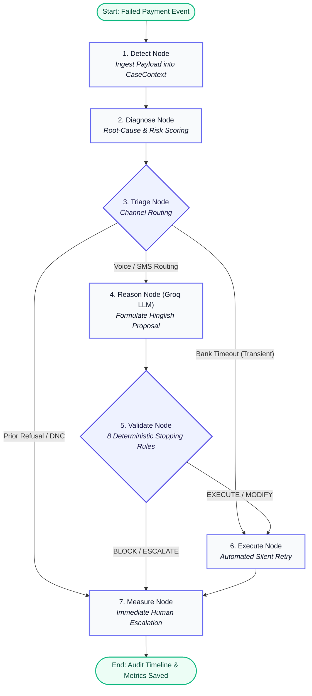

# ⚡ AI Revenue Recovery Agent
### Razorpay AI Buildathon 2026 | Track 03: Autonomous Revenue Recovery

> **"AI proposes. Control Plane decides. System executes."**  
> An enterprise-grade, bounded autonomous agent for recovering failed recurring payments (UPI Autopay, EMIs, and Subscriptions) with an uncompromising **Deterministic Policy Engine**, real-time **Razorpay Webhook Integration**, and natural **Hinglish Neural Voice Calls**.

---

## 🎯 Executive Summary & Problem Statement

In India's rapidly expanding digital payment ecosystem, recurring payments (UPI Autopay mandates, loan EMIs, SaaS subscriptions) suffer from an **involuntary failure rate of 12% to 20%**. 

### The Industry Dilemma:
1. **Generic Dunning Emails & SMS**: Have abysmal conversion (<4%), as customers ignore generic payment links.
2. **Human Calling Centers**: Are expensive, slow to respond, and fail to scale for low-to-medium ticket transactions.
3. **Unconstrained AI Chatbots / Voice Bots**: Are catastrophic for finance—LLMs **hallucinate**, offer rogue discounts, violate compliance (e.g. asking for OTPs/CVVs), and spam customers into regulatory Do-Not-Contact (DNC) violations.

### Our Solution:
The **AI Revenue Recovery Agent** bridges this gap. It pairs the natural reasoning and multilingual conversational capabilities of LLMs (**Groq Compound Llama 3.1 / Qwen**) with an isolated, zero-trust **Deterministic Control Plane** written in pure Python. Every single action proposed by the AI must pass through **8 hard stopping rules** before any API call or communication is triggered.

---

## 🏛️ System Architecture: Separation of Powers

```
                                  ┌──────────────────────────────┐
                                  │   Razorpay Webhook Event     │
                                  │   (payment.failed on rzp.io) │
                                  └──────────────┬───────────────┘
                                                 │
                                                 ▼
                                  ┌──────────────────────────────┐
                                  │     1. Detection & Triage    │
                                  │ (Channel Routing: Voice/SMS) │
                                  └──────────────┬───────────────┘
                                                 │
                                                 ▼
                                  ┌──────────────────────────────┐
                                  │  2. LLM Reasoning Layer      │
                                  │ (Groq Llama 3.1 in Hinglish) │
                                  └──────────────┬───────────────┘
                                                 │
                                                 ▼
             ┌────────────────────────────────────────────────────────────────────────┐
             │                 3. DETERMINISTIC CONTROL PLANE (Pure Python)           │
             │                                                                        │
             │   [Rule 1] Do-Not-Contact Check ────────────────────────► [ BLOCK ]    │
             │   [Rule 2] Anti-Phishing / OTP Check ───────────────────► [ BLOCK ]    │
             │   [Rule 3] Contact Attempt Ceiling (<= 3) ──────────────► [ BLOCK ]    │
             │   [Rule 4] Consecutive Refusal Threshold (<= 2) ────────► [ ESCALATE ] │
             │   [Rule 5] Payment Retry Limits (<= 2) ─────────────────► [ BLOCK ]    │
             │   [Rule 6] Extension Days Cap (Max 7 Days) ─────────────► [ MODIFY ]   │
             │   [Rule 7] Discount Percentage Cap (Max 15%) ───────────► [ MODIFY ]   │
             │   [Rule 8] Campaign Incentive Budget Cap (Rs.50k) ──────► [ CAPPED ]   │
             └───────────────────────────────────┬────────────────────────────────────┘
                                                 │
                                                 ▼
                                  ┌──────────────────────────────┐
                                  │    4. Safe Action Execution  │
                                  │ (Edge-TTS Audio + Razorpay)  │
                                  └──────────────┬───────────────┘
                                                 │
                                                 ▼
                                  ┌──────────────────────────────┐
                                  │    5. Cryptographic Audit    │
                                  │ (Immutable SQLite Timeline)  │
                                  └──────────────────────────────┘
```

---

## 🛡️ The 8 Hard Stopping Rules (Policy Engine)

The Control Plane enforces a strict priority waterfall. No AI proposal can bypass these bounds:

| # | Guardrail Rule | Target Risk | Deterministic Policy Action | Concrete Example |
|---|---|---|---|---|
| **1** | `check_do_not_contact` | Regulatory compliance & harassment | **BLOCK** immediately | Customer says "Don't call me" $\rightarrow$ Communication permanently halted. |
| **2** | `check_sensitive_data` | Anti-phishing & credential theft | **BLOCK** immediately | AI asks for OTP/CVV/Password $\rightarrow$ Immediately terminated and flagged. |
| **3** | `check_max_contacts` | Customer spam prevention | **BLOCK** | Maximum 3 contact attempts per billing cycle. |
| **4** | `check_consecutive_refusals` | Negative sentiment fatigue | **ESCALATE** to Human | 2 consecutive refusals $\rightarrow$ Routed directly to human recovery officer. |
| **5** | `check_max_retries` | Bank penalty fees | **BLOCK** | Maximum 2 automated retry calls before halting. |
| **6** | `check_max_extension` | Cashflow delay exploitation | **MODIFY** (Cap to $\le$ 7 Days) | Customer demands 20 days grace $\rightarrow$ Capped strictly at 7 days. |
| **7** | `check_max_discount` | Margin erosion & rogue discounts | **MODIFY** (Cap to $\le$ 15%) | Customer demands 40% discount $\rightarrow$ Capped strictly at 15%. |
| **8** | `check_budget_exhaustion` | Merchant campaign overspending | **MODIFY / BLOCK** | Campaign budget remaining $< 5\%$ $\rightarrow$ Zero-discount policy enforced. |

---

## ⚡ LangGraph 7-Stage StateGraph Workflow

The entire recovery lifecycle is orchestrated via **LangGraph**:



---

## 💳 Real Razorpay API Integration (Live Mode)

This project integrates with **official Razorpay APIs** in test/sandbox mode:
- **SDK Wrapper (`backend/razorpay_client.py`)**: Authenticates via `RAZORPAY_KEY_ID` & `RAZORPAY_KEY_SECRET` with exponential backoff.
- **Hosted Payment Pages (`https://rzp.io`)**: Generates authentic Razorpay payment links for customer retries.
- **Webhook Ingestion (`POST /api/webhook/razorpay`)**: Receives real `payment.failed` webhook payloads triggered on Razorpay's checkout infrastructure.
- **Tunneling via ngrok**: Exposes the local FastAPI endpoint to receive live webhook payloads from Razorpay's cloud servers.

---

## 🗣️ Natural Hinglish Multimodal Voice Engine

To maximize recovery across diverse Indian demographics, the agent reasons and communicates in **balanced Hinglish**:
- **Tailored Contexts**: Recognizes nuances in UPI Autopay failures, EMI default penalties, and debit card mandate expirations.
- **Dynamic Neural Speech Synthesis**: Integrates `edge-tts` (`hi-IN-MadhurNeural`) to convert custom LLM dialogue into natural human voice audio on-the-fly.
- **Live Script Inspector**: Real-time transcript viewer in the frontend dashboard displaying the exact dialogue spoken by the agent.

---

## 📊 Interactive Dashboard & Live Sandbox

The dashboard features a **soft, modern light theme with pastel color fusion**:

1. **Live vs. Benchmark Mode Switcher**:
   - **🌐 All Cases**: Combined portfolio overview.
   - **🟢 Live Razorpay**: Displays *only* authentic webhook transactions (`RZP-*`).
   - **📊 Synthetic Benchmark**: Evaluates 200 diverse synthetic cases across all failure tiers.
2. **Interactive Policy Sandbox Widget**:
   - Allows judges to type adversarial prompts (e.g. demanding 50% discount or requesting OTPs) and watch the Control Plane intercept, block, or modify the action live.
3. **LangGraph Pipeline Visualizer**:
   - Interactive modal simulating different execution pathways (Silent Retry, Guardrail Block, Human Escalation).
4. **Full Audit Trail & Ledger**:
   - Minute-by-minute timeline with input/output payloads and merchant incentive budget deductions.

---

## 🚀 Quick Start Guide

### Prerequisites
- Python 3.10+
- Node.js 18+
- Groq API Key (Free tier at [console.groq.com](https://console.groq.com))
- Razorpay Test Key (Free sandbox at [dashboard.razorpay.com](https://dashboard.razorpay.com))

---

### Step 1: Clone and Install Dependencies

```bash
# Clone the repository
git clone https://github.com/Aditya13hack/ai-revenue-recovery-agent.git
cd ai-revenue-recovery-agent

# Set up Python virtual environment
python -m venv venv
venv\Scripts\activate        # On Windows (PowerShell/CMD)
# source venv/bin/activate   # On Linux/macOS

# Install Python requirements
pip install -r requirements.txt

# Install Frontend dependencies
cd frontend
npm install
cd ..
```

---

### Step 2: Configure Environment Variables

Create `.env` in the project root:
```env
# LLM Configuration (Groq Free Tier)
GROQ_API_KEY=gsk_your_groq_api_key_here
LLM_MODEL=groq/compound-mini

# Razorpay Test Credentials
RAZORPAY_KEY_ID=rzp_test_your_key_id
RAZORPAY_KEY_SECRET=your_key_secret

# Policy Limits
MAX_DISCOUNT_PERCENT=15.0
MAX_EXTENSION_DAYS=7
MAX_CONTACT_ATTEMPTS=3
MAX_PAYMENT_RETRIES=2
CAMPAIGN_BUDGET=50000.0
```

---

### Step 3: Run the Synthetic Benchmark (200 Cases)

```bash
# 1. Generate the 200-case dataset
python -m scripts.generate_dataset

# 2. Run the recovery pipeline batch
python -m scripts.run_batch
```

---

### Step 4: Start the Applications

```bash
# Terminal 1: Backend Server (FastAPI on Port 8000)
python -m backend.main

# Terminal 2: Frontend Dashboard (Vite on Port 5173)
cd frontend
npm run dev
```

Open **`http://localhost:5173`** in your browser.

---

### Step 5: (Optional) Test Real Razorpay Webhook In Live Mode

```bash
# 1. Start ngrok tunnel in a new terminal
ngrok http 8000

# 2. In Razorpay Dashboard -> Settings -> Webhooks:
# Set URL to: https://your-ngrok-url.ngrok-free.app/api/webhook/razorpay
# Event: payment.failed

# 3. Create a test order and trigger a failed payment
python -m scripts.live_demo --create-order
```

---

## 🧪 Automated Testing Suite

All 8 stopping rules and triage classifiers are verified via automated unit tests:

```bash
python -m pytest tests/ -v
```

```
============================= 27 passed in 1.98s ==============================
tests/test_budget_tracker.py::test_consume_reduces_balance PASSED        [  3%]
tests/test_budget_tracker.py::test_thread_safety PASSED                  [ 14%]
tests/test_control_plane.py::test_block_on_do_not_contact PASSED         [ 22%]
tests/test_control_plane.py::test_block_on_sensitive_data PASSED         [ 25%]
tests/test_control_plane.py::test_modify_on_discount_exceeding_limit PASSED [ 44%]
tests/test_stopping_rules.py::test_check_max_extension_days PASSED       [ 74%]
tests/test_triage.py::test_voice_routing_high_value PASSED               [ 85%]
... [27/27 Passing]
```

---

## 📁 Repository Structure

```
Project404/
├── backend/
│   ├── main.py                     # FastAPI backend & webhook listener
│   ├── config.py                   # Centralized configuration & thresholds
│   ├── razorpay_client.py          # Official Razorpay SDK wrapper & retry logic
│   ├── control_plane/              # CORE DIFFERENTIATOR: Deterministic Policy Engine
│   │   ├── policy_engine.py        # Decision waterfall (BLOCK/MODIFY/ESCALATE/EXECUTE)
│   │   ├── stopping_rules.py       # 8 hard stopping rules
│   │   ├── budget_tracker.py       # Thread-safe merchant budget manager
│   │   └── rules_config.py         # Merchant policy limits dataclass
│   ├── orchestrator/               # LangGraph state & node execution
│   │   ├── graph.py                # Compiled StateGraph workflow
│   │   └── state.py                # TypedDict state schema
│   ├── reasoning/                  # LLM agents & Hinglish prompts
│   │   ├── agent.py                # Groq Compound agent
│   │   └── schemas.py              # Pydantic data schemas
│   ├── triage/                     # Channel router & root-cause classifier
│   ├── database/                   # SQLite models & session management
│   ├── voice/                      # Dynamic Edge-TTS neural voice synthesis
│   ├── audit/                      # Cryptographic audit timeline reconstruction
│   └── metrics/                    # Batch ROI & recovery rate calculator
├── frontend/                       # Modern React + Vite + Tailwind CSS Dashboard
│   ├── src/
│   │   ├── components/
│   │   │   ├── MetricsPanel.tsx    # Hero recovery metrics & ROI banner
│   │   │   ├── CaseList.tsx        # Filterable case explorer with live badges
│   │   │   ├── CaseDetail.tsx      # Slide-out case inspector
│   │   │   ├── VoicePlayer.tsx     # Neural audio player & AI dialogue box
│   │   │   ├── GraphVisualizer.tsx # Interactive LangGraph topology modal
│   │   │   ├── PolicySandbox.tsx   # Interactive Guardrail Testing Sandbox
│   │   │   └── BudgetGauge.tsx     # Live campaign incentive expenditure gauge
├── scripts/
│   ├── generate_dataset.py         # 200 synthetic case generator
│   ├── run_batch.py                # Batch pipeline execution runner
│   └── live_demo.py                # End-to-end Razorpay API CLI demo
└── tests/                          # 27 unit & integration tests
```

---

## 👥 Authors & Acknowledgments

- **Track**: Track 03 — AI Revenue Recovery Agent
- **Event**: Razorpay AI Buildathon 2026
- **License**: MIT License
